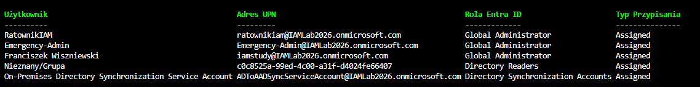

# Module 04: Privileged Identity Management (PIM) Auditing

## Project Overview
This module focuses on the **security auditing of privileged roles** within Microsoft Entra ID. It leverages the Microsoft Graph API to programmatically identify accounts with permanent (Assigned) administrative privileges, which is a critical step in transitioning from "standing access" to a "Zero Trust / Just-In-Time" (JIT) model.

## Features
- **Automated PIM Audit**: Queries the tenant to retrieve all active role assignments.
- **Identity Resolution**: Maps unique Principal IDs to User Principal Names (UPN) for readable reporting.
- **Security Insight**: Differentiates between permanent assignments and eligible roles, helping identify high-risk access configurations.

## Prerequisites
- PowerShell 7.x
- `Microsoft.Graph` module installed.
- Appropriate API permissions: `RoleManagement.Read.Directory`, `PrivilegedAccess.Read.AzureAD`.

## How to use
1. Run the script: `./Configure-PIMRoles.ps1`
2. Authenticate with your Global Administrator or Privileged Role Administrator account.
3. Review the generated table in your terminal to identify potential security risks (e.g., permanent Global Admin assignments).
