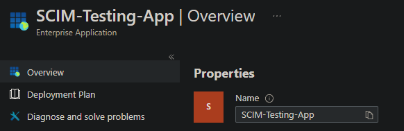

# IAM Lab: SCIM 2.0 User Provisioning & Schema Analysis (RFC 7643)

## Project Overview
This laboratory documents the implementation and testing of automated user provisioning (Lifecycle Management) from Microsoft Entra ID to a custom target system using the SCIM 2.0 protocol standard. The objective was to configure the synchronization architecture, map complex identity attributes, and analyze the raw JSON payloads transmitted during the provisioning process.

---

## Step-by-Step Implementation Guide

### 1. Target Endpoint & Enterprise App Configuration
* **Target Environment**: A dedicated SCIM test endpoint was provisioned to act as the target repository.
* **App Creation**: Created a custom enterprise application (`SCIM-Testing-App`) within Microsoft Entra ID using the *Non-gallery application* integration pathway.
* **Credential Validation**: Configured the Provisioning Mode to *Automatic*, establishing connectivity by mapping the unique Tenant URL and injecting the secure Bearer Token.

### 2. Attribute Mapping & Schema Debugging (Troubleshooting Case)
During the initial *Provision on demand* phase, a critical schema mismatch error was detected (`SystemForCrossDomainIdentityManagementServiceIncompatible`). 

The target system API rejected the incoming request with a `HTTP 400 Bad Request` because Microsoft Entra ID's default state did not include the mandatory `emails` attribute required by the target SCIM server core schema.

#### Proof of Issue Resolution:
Below is the execution state highlighting the initial mapping failure due to the missing required email field:

#### Corrective Actions Taken:
1. Navigated to the **Attribute Mapping** settings of the Enterprise Application.
2. Injected a new direct mapping attribute rule.
3. Mapped the source directory attribute `userPrincipalName` to the target SCIM attribute `emails[type eq "work"].value` to guarantee that every provisioned identity carries a valid email routing string.
4. Committed and saved the updated synchronization schema.

### 3. Execution & Provisioning on Demand
With the schema correctly aligned, a *Provision on demand* cycle was triggered for the test identity (`Basia HR`). 

The synchronization engine successfully verified the user scope, matched identity metrics between boundaries, and executed the remote resource creation payload API call.

#### Proof of Successful Provisioning:

---

## Technical Data Analysis

The raw JSON payload outbound communication sequence was extracted and reviewed post-execution. The full structured output is maintained in the companion file `scim_user_payload.json`.

### Schema Architecture Decoupling:
* **Core User Schema** (`urn:ietf:params:scim:schemas:core:2.0:User`): Handles basic identity vectors including `userName`, `displayName`, and multi-valued `emails` blocks.
* **Enterprise User Extension** (`urn:ietf:params:scim:schemas:extension:enterprise:2.0:User`): Utilized to map corporate structure details, specifically delivering the `department` attribute over the API boundary.