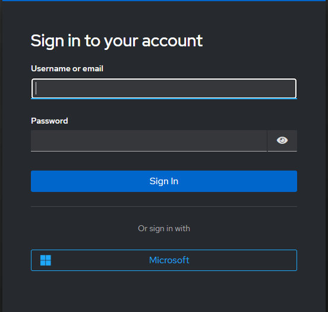

# 🔐 Keycloak Identity Brokering with Microsoft Entra ID


A comprehensive laboratory environment (Proof of Concept) demonstrating the implementation of **Single Sign-On (SSO)** and **Identity Federation**. This project integrates a local instance of Keycloak running inside a Docker container with **Microsoft Entra ID** (formerly Azure AD) as an external cloud Identity Provider (IdP) using the **OpenID Connect (OIDC)** protocol.

---

## 🏗️ Architecture & Environment Setup

* **Identity & Access Management (IAM):** Keycloak (acting as an Identity Broker)
* **Identity Provider (IdP):** Microsoft Entra ID (Cloud Tenant)
* **Host OS Infrastructure:** Windows 11 Home/Pro with **WSL 2** (Windows Subsystem for Linux) backend
* **Containerization Engine:** Docker Desktop v20.x+

---

## 🚀 Step-by-Step Implementation

### Step 1: WSL 2 Engine Repair & Docker Startup
During initial setup, Docker Desktop required a functional Windows Subsystem for Linux backend. 
1. Fixed the missing Linux environment by triggering the kernel update via the command line interface:
   ```bash
   wsl --update
   ```
2. Rebooted the host system to finalize system features integration.
3. Successfully initiated the Docker Engine backend.

### Step 2: Deploying Keycloak Container
Keycloak was deployed in development mode exposing port `8080` with pre-defined administrator credentials:

```bash
docker run -p 8080:8080 \
  -e KEYCLOAK_ADMIN=xxx \
  -e KEYCLOAK_ADMIN_PASSWORD=xxx \
  quay.io/keycloak/keycloak:latest start-dev
```

Once the administration console loaded at `http://localhost:8080`, a dedicated, isolated project environment called a **Realm** was created under the name `Moj-Lab-IT` to isolate configurations from the default `master` management instance.

### Step 3: Application Registration in Microsoft Entra ID
To establish trust between the local instance and the Microsoft cloud, a new enterprise app integration named `Moj-Keycloak-Lab` was registered in the Azure Portal:
* **Redirect URI (Web platform endpoint):** Configured to point directly back to the local Keycloak broker listener:  
    `http://localhost:8080/realms/Moj-Lab-IT/broker/microsoft/endpoint`
* **Secrets and Parameters Extraction:** Generated a secure **Client Secret Value** and securely stored the **Application (client) ID** and **Directory (tenant) ID** strings for backend synchronization.

### Step 4: Finalizing Identity Provider Linking
Inside Keycloak's `Moj-Lab-IT` identity administration panel, a native **Microsoft** Identity Provider template was added. 
* Injected the extracted parameters (`Client ID`, `Client Secret`, and `Tenant ID`).
* Keycloak automatically connected to Microsoft's OIDC discovery endpoint (`login.microsoftonline.com`) to register and validate authentication tokens.

---

## 🎯 Verification & Authentication Flow

The final end-to-end integration test successfully verified the modern enterprise **Identity Brokering** workflow:

1.  **Client Discovery:** The user accesses the secured local account portal (`http://localhost:8080/realms/Moj-Lab-IT/account/`).
2.  **Federated Button:** Keycloak presents a custom unified login interface containing the official **"Sign in with Microsoft"** action button.
3.  **Secure Redirect:** Clicking the option safely redirects the browser context to the official Microsoft authentication domain (`login.microsoftonline.com`).
4.  **Cloud Handshake:** The cloud user enters their laboratory credentials (`@iamlab2026.onmicrosoft.com`). Microsoft signs an encrypted cryptographic identity token.
5.  **Just-In-Time (JIT) Provisioning:** Keycloak parses the token claims, intercepts user attributes (First Name, Last Name, Email), prompts for account verification via the "Update Account Information" workflow, and dynamically generates a local user record.

---
*This lab effectively mirrors production-grade enterprise cloud security standards. It demonstrates practical competency in containerization, federation handshakes, OpenID Connect specifications, and identity lifecycle automation.*

```